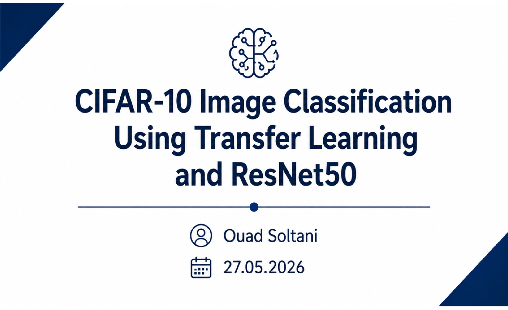
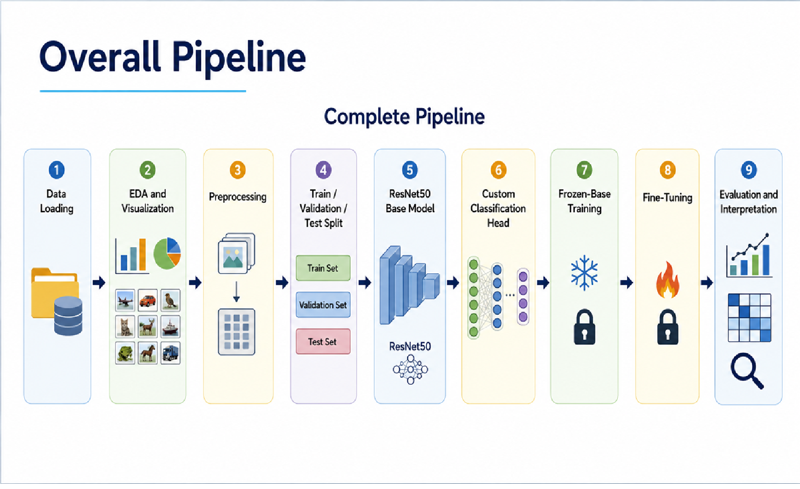
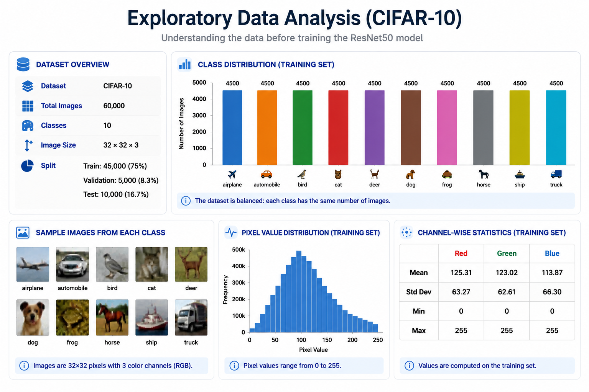
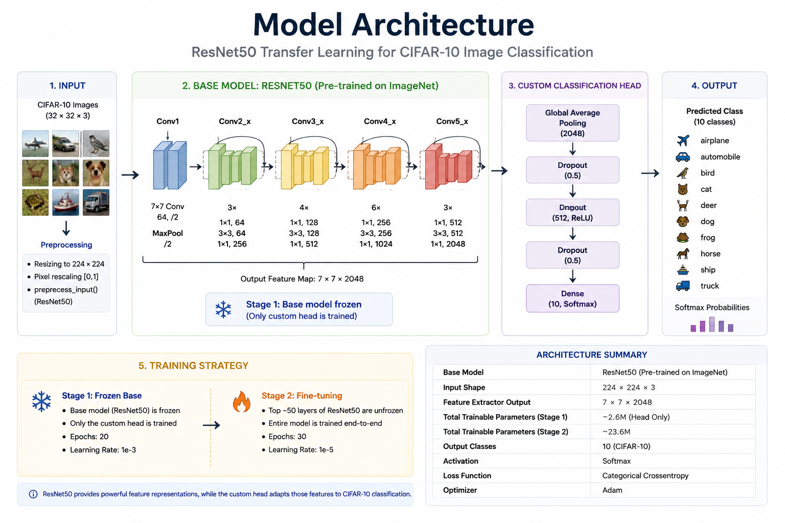
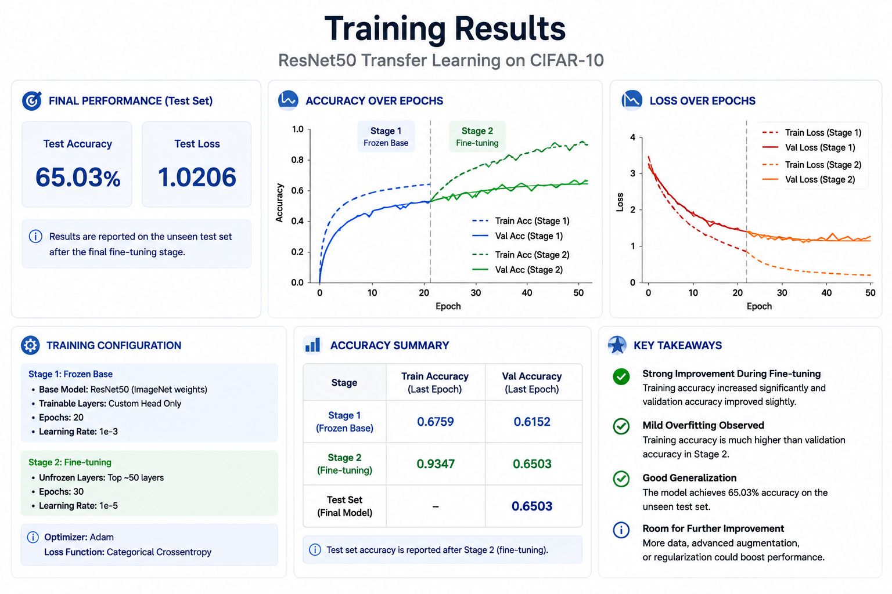
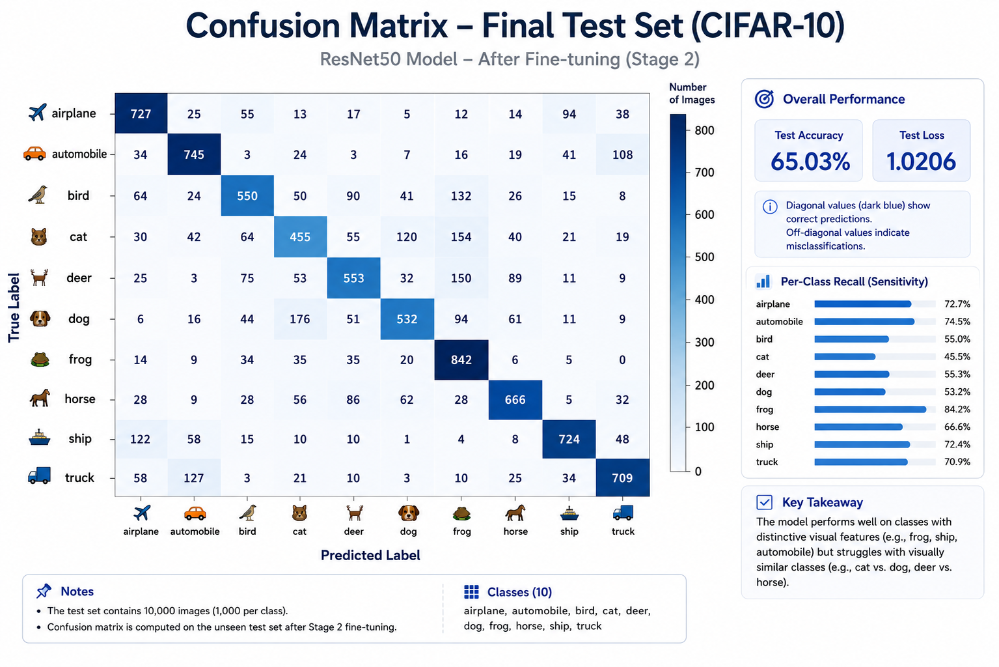

# CIFAR-10 Image Classification Using Transfer Learning and ResNet50




---

# Project Overview

This project demonstrates how **transfer learning** can be applied to classify **CIFAR-10** images using a pretrained **ResNet50** convolutional neural network.

The objective was not only to build an accurate image classifier, but also to understand the complete computer vision workflow—from data exploration and preprocessing to model training, fine-tuning, evaluation, and error analysis.

---

# Project Pipeline

The complete workflow followed during the project is illustrated below.



The pipeline consists of:

- Data loading
- Exploratory Data Analysis (EDA)
- Data preprocessing
- Train/Validation/Test split
- Transfer learning with ResNet50
- Custom classification head
- Frozen-base training
- Fine-tuning
- Model evaluation
- Error analysis

---

# Exploratory Data Analysis (EDA)

Before training the model, the dataset was explored to better understand its characteristics.



### Main observations

- CIFAR-10 contains **10 object classes**.
- Images are very small (**32 × 32 RGB**), making classification challenging.
- The selected training subset is approximately balanced across all classes.
- Low image resolution limits fine visual details and increases confusion between similar objects.

---

# Model Architecture

A pretrained **ResNet50** model was used as the feature extractor, followed by a custom classification head.



### Architecture

- Pretrained ResNet50 backbone
- GlobalAveragePooling2D
- Dense + ReLU
- Dropout
- Dense + ReLU
- Dropout
- Softmax (10 classes)

### Why ResNet50?

- Powerful pretrained CNN
- Already learned useful visual features from ImageNet
- Faster convergence than training from scratch
- Strong balance between performance and computational cost

---

# Training Strategy

The model was trained in two stages.

### Stage 1 — Frozen Base

- ResNet50 weights remained frozen.
- Only the custom classification head was trained.
- Stable initial learning while preserving pretrained features.

### Stage 2 — Fine-Tuning

- The last ResNet50 layers were unfrozen.
- A much smaller learning rate was used.
- Allowed the pretrained features to adapt to CIFAR-10.

---

# Training Results

The learning curves below summarize both training stages.



### Main findings

- Training accuracy steadily increased.
- Validation accuracy improved to approximately **65%**.
- Fine-tuning further improved training performance.
- Validation accuracy plateaued, indicating **mild overfitting**.
- Overall, transfer learning produced stable learning and good generalization.

---

# Final Model Evaluation

The final model was evaluated on the unseen CIFAR-10 test set.

| Metric | Result |
|--------|--------:|
| Test Accuracy | **65.03%** |
| Test Loss | **1.0206** |

---

# Confusion Matrix

The confusion matrix summarizes prediction performance for each class.



### Main observations

The model performed well on visually distinctive classes such as:

- Frog
- Ship
- Airplane
- Automobile

The largest confusion occurred between visually similar categories:

- Cat ↔ Dog
- Deer ↔ Horse
- Automobile ↔ Truck
- Ship ↔ Airplane

These errors are expected because CIFAR-10 images contain limited visual information.

---

# Final Evaluation

A complete evaluation of the final model is shown below.


The evaluation combines:

- Final test accuracy and loss
- Per-class performance
- Prediction examples
- Error analysis
- Strengths and limitations of the model

---

# Key Results

- ✅ Transfer learning significantly improved performance.
- ✅ ResNet50 extracted meaningful visual features.
- ✅ Validation and test evaluation confirmed reasonable generalization.
- ✅ Fine-tuning improved learning but introduced mild overfitting.
- ✅ Final test accuracy reached **65.03%**.

---

# Limitations

Several factors limited model performance:

- Small image resolution (32 × 32)
- Similar object categories
- Limited training subset
- Google Colab runtime constraints
- Limited hyperparameter optimization

---

# Future Improvements

Potential improvements include:

- Train on the complete CIFAR-10 dataset
- Improve data augmentation
- Increase image resolution
- Tune hyperparameters systematically
- Fine-tune additional layers
- Test EfficientNet or DenseNet architectures

---

# Repository Structure

```text
.
├── assets/
│   ├── project_banner.png
│   ├── pipeline.png
│   ├── eda_summary.png
│   ├── model_architecture.png
│   ├── training_results.png
│   ├── confusion_matrix.png
│   └── final_evaluation.png
│
├── notebooks/
│   └── CIFAR10_ResNet50_Classification.ipynb
│
├── reports/
│   ├── Project_Summary.pdf
│   └── Presentation.pdf
│
├── model_metrics.md
├── README.md
└── requirements.txt
```

---

# Installation

Clone the repository

```bash
git clone https://github.com/Ouad90/cifar10-resnet50-classification.git
cd cifar10-resnet50-classification
```

Install dependencies

```bash
pip install -r requirements.txt
```

Launch the notebook

```bash
jupyter notebook notebooks/CIFAR10_ResNet50_Classification.ipynb
```

---

# Technologies Used

- Python
- TensorFlow
- Keras
- NumPy
- Matplotlib
- Scikit-learn
- Google Colab
- Git
- GitHub

---

# Author

**Dr. Ouad Soltani**

PhD Plant Biology | Data Analytics & AI | Computer Vision | Machine Learning

---

# License

This project is licensed under the **MIT License**.
